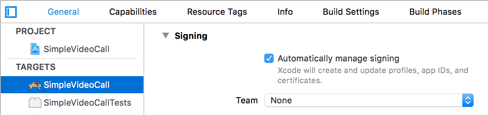

# bit6-react-native-samples
Sample apps for Bit6 in React Native

## Simple Messaging Demo

Sample app for sending/receiving signals using Bit6 in React Native

### Usage
- Clone the repository
- run in terminal

	```
	cd SimpleMessaging
	npm install
	```

### Run in Android

1. Open Android Studio.
2. Import the project at `/android/` folder.
3. Run the project.


### Run in iOS

1. Open `/ios/SimpleMessaging.xcodeproj` in Xcode.
2. Set a team for `SimpleMessaging ` and `SimpleMessaging Tests` targets.

	

3. Run the project.

## Simple Video Call Demo

Sample app for Bit6 video sessions in React Native

### Usage
- Clone the repository
- run in terminal

	```
	cd SimpleVideoCall
	npm install
	react-native link
	```

### Run in Android

1. Open Android Studio.
2. Import the project at `/android/` folder.
3. Run the project.


### Run in iOS

1. Open `/ios/SimpleVideoCall.xcodeproj` in Xcode.
2. Set a team for `SimpleVideoCall` and `SimpleVideoCallTests` targets.

	

3. Run the project.
